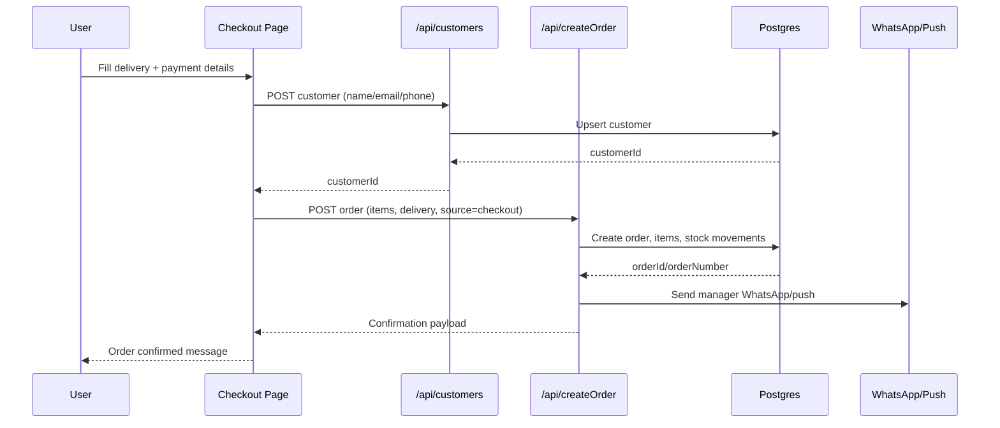
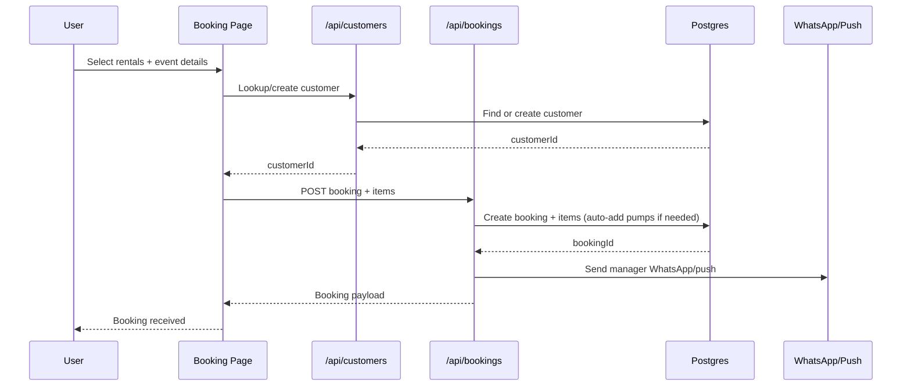

# Reebs Frontend Documentation

## Overview
Reebs is a hybrid ERP + ecommerce site built with React and Vite. The frontend is split into:
- Public storefront (Home, Shop, Rentals, Gallery, Contact)
- Checkout + booking flows (Cart, Checkout, Book)
- Admin console (inventory, orders, bookings, accounting, HR, etc.)

The app consumes the REEBS API wrapper at `/api/*` on `https://api.reebspartythemes.com`. Legacy `/api/*` browser calls are translated by `patchOrganizationFetch()` during the Cloudflare/API migration.

## Stack
- React 19 + Vite
- React Router for routing
- Contexts for auth and cart state
- CSS files (global + page-specific)
- FontAwesome + Lucide for iconography
- Leaflet for maps
- Framer Motion for animation

## Entry Points and Boot
- `src/main.jsx` bootstraps the React app and calls `patchOrganizationFetch()`.
- `patchOrganizationFetch()` maps legacy function paths to `/api/*`, includes credentials, and injects `x-organization-id` and `Authorization` headers when available.
- `src/App.jsx` wires routing, auth gating, cart overlay, and global UI shell.

## System Architecture (High Level)
```mermaid
flowchart LR
  Browser[Web Frontend (React/Vite)] -->|HTTPS| API[REEBS API Wrapper]
  Mobile[Manager App (Expo)] -->|HTTPS| API
  API -->|SQL| DB[(PostgreSQL)]
  API -->|Notifications| WhatsApp[WhatsApp Cloud API]
  API -->|Push| Expo[Expo Push Service]
  API -->|Geocode| OSM[Nominatim]
  API -->|Geocode (optional)| Google[Google Geocoding API]
```

## Route Map
Public pages:
- `/` -> Home
- `/about` -> About
- `/shop` -> Shop
- `/rentals` -> Rentals list
- `/rentals/:slug` -> RentalItem detail
- `/gallery` -> Gallery
- `/faq` -> FAQ
- `/contact` -> Contact
- `/book` -> Rental booking form
- `/cart` -> Cart
- `/checkout` -> Checkout
- `/privacy-policy`, `/refund-policy`, `/delivery-policy`, `/terms-of-service`

Auth and admin pages:
- `/login` -> Admin login
- `/admin` -> Admin dashboard (KPIs)
- `/admin/inventory` -> Inventory
- `/admin/orders` -> Orders list
- `/admin/orders/new` -> Manual order builder
- `/admin/bookings` -> Booking admin
- `/admin/schedule` -> Scheduler
- `/admin/accounting` -> Financials
- `/admin/expenses` -> Expenses
- `/admin/hr` -> HR profiles
- `/admin/documents` -> Documents and invoices
- `/admin/timesheets` -> Timesheets
- `/admin/vendors` -> Vendors
- `/admin/maintenance` -> Maintenance logs
- `/admin/delivery` -> Delivery board
- `/admin/roles` -> Roles and permissions
- `/admin/settings` -> Settings
- `/admin/customers` -> Customers
- `/admin/invoicing` -> Invoicing
- `/admin/marketing` -> Marketing and discounts

Protected routes use `RequireAuth` in `src/App.jsx`. Some admin routes are blocked on mobile via `MobileRestricted`.

## State Management
### AuthContext
Location: `src/components/AuthContext.jsx`
- Stores the logged-in user and token in localStorage or sessionStorage.
- `login(email, password, remember)` calls `/api/login` and stores token.
- `logout()` clears stored user and token.
- `updateUser()` merges profile updates and keeps token.

### CartContext
Location: `src/components/CartContext.jsx`
- Cart items stored in localStorage.
- Fetches currency exchange rates from `v6.exchangerate-api.com` (requires `VITE_CURRENCY_API_KEY`).
- Provides `addToCart`, `removeFromCart`, `updateQuantity`, `clearCart`, `convertPrice`, `formatCurrency`.

### CurrencyContext (optional)
Location: `src/components/CurrencyContext.jsx`
- Supports fallback rates and a separate exchange API key (`VITE_EXCHANGE_API_KEY`).
- Not currently wired in `App.jsx`, but available for future use.

## API Integration
All API calls should resolve through `/api/*` on the configured API base.
- `patchOrganizationFetch()` automatically maps legacy `/api/*` paths to `/api/*`, includes credentials, and adds `x-organization-id` and `Authorization` headers if present.
- Auth token is stored in `window.__reebsAuthToken` and local/session storage.
- Set `VITE_API_BASE_URL` to override the API host (production: `https://api.reebspartythemes.com`). `VITE_BACKEND_BASE_URL` is a legacy fallback.

Caching:
- `src/utils/inventoryCache.js` caches inventory for 5 minutes in sessionStorage.
- `src/pages/Shop.jsx` has its own session cache for product lists.

## Key User Flows
### Shop
Location: `src/pages/Shop.jsx`
- Fetches inventory from `/api/inventory`.
- Filters out rental items by inventory product code.
- Supports search, category filters, in-stock toggle, pagination, and a featured carousel.
- Requires auth state to be ready and authenticated before it loads inventory.

### Cart
- Cart is stored locally and rendered via `CartOverlay` and `Cart` page.
- Stock limits are enforced when adding/updating items.

### Checkout
Location: `src/pages/Checkout.jsx`
- Creates or finds customer via `/api/customers`.
- Submits order to `/api/createOrder` (manual payment flow).
- Persists checkout draft in localStorage.
- Does not process payments; it records intent and order details.

Sequence diagram (checkout):


### Rentals Booking
Location: `src/pages/Book.jsx`
- Loads rentals from `/api/inventory` and bouncy castle metadata from `/api/bouncy_castles`.
- Validates booking form, adds bundle discounts, and posts to `/api/bookings`.
- Uses localStorage to save draft bookings.

Sequence diagram (booking):


### Login
Location: `src/pages/Login.jsx`
- Uses `AuthContext.login()` to authenticate and redirect to `/admin`.

## Admin Console Modules
Each admin page consumes a focused API endpoint:
- Inventory: `/api/inventory`, `/api/stock`, `/api/stockActivity`
- Orders: `/api/orders`, `/api/createOrder`
- Bookings: `/api/bookings`, `/api/customers`
- Scheduler: `/api/bookings` + inventory and customer lookups
- Accounting/Financials: `/api/financials`, `/api/orders`, `/api/bookings`
- Expenses: `/api/expenses`
- HR: `/api/hr`
- Documents + Invoicing: `/api/documents`, `/api/generateInvoice`, `/api/getInvoiceDetails`
- Timesheets: `/api/timesheets`
- Vendors: `/api/vendors`
- Maintenance: `/api/maintenance`
- Delivery: `/api/deliveries`
- Marketing/Discounts: `/api/marketing`
- Dashboard KPIs: `/api/orderStats`, `/api/userStats`

## UI and Styling
- Global styles: `src/index.css`, `src/styles/reset.css`.
- Page styles: `src/pages/master.css` and per-component CSS files.
- `ClickSpark` adds cursor spark effects site-wide.
- `BackToTop` provides navigation back to the top of long pages.

## Testing
- Playwright tests live in `tests/` with config in `playwright.config.ts`.
- Run with `npm run test:e2e` or `npm run test:e2e:ui`.

## Local Development
- Frontend only: `npm run dev`
- Full stack with API handlers: `pnpm run dev:reebs`

## Environment Variables (Frontend)
- `VITE_CURRENCY_API_KEY` for CartContext exchange rates.
- `VITE_EXCHANGE_API_KEY` for CurrencyContext (optional).

## Related Files
- Routing and layout: `src/App.jsx`
- Boot + fetch patching: `src/main.jsx`, `src/utils/organization.js`
- Auth: `src/components/AuthContext.jsx`
- Cart + currency: `src/components/CartContext.jsx`, `src/components/CurrencyContext.jsx`
- Inventory cache: `src/utils/inventoryCache.js`
