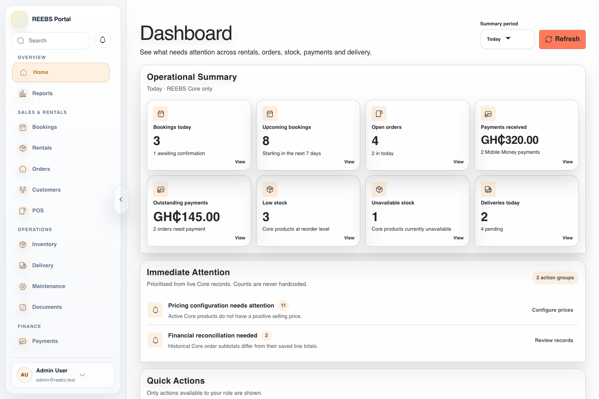
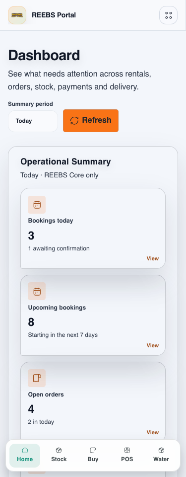
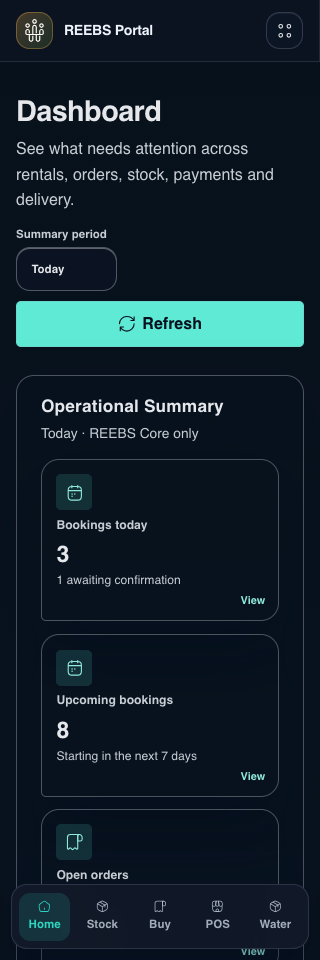
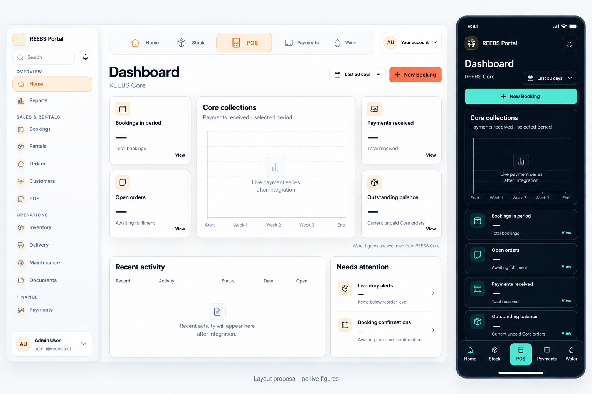

# Dashboard / Quick Access — approval and implementation evidence

The user approved the proposal below on 2026-10-01. Local implementation now
preserves native Faako components rather than treating generated component shapes
as authoritative. See [implementation handoff](../../apps/reebs/dashboard-quick-access-revamp.md)
and [design QA](../../../apps/reebs-portal/design-qa.md) for final evidence and limits.
The baseline and proposal below remain as the review trail.

Captured 2026-10-01. Existing local code, synthetic API fixtures, no real accounts,
secrets, database or provider calls. The fixtures reuse the existing Dashboard
browser test. This is baseline visual discovery, not a completed revamp.

## Captured steps

1. **Desktop Dashboard, 1440px/light — functional baseline; composition needs work.**
   Sidecar remains visible and authoritative. Eight similarly weighted KPI cards
   occupy the primary area. No central performance chart or desktop Quick Access
   bar is present. Profile actions already exist at the foot of Sidecar.
   
2. **Mobile Dashboard, 375px/light — fits horizontally, excessive vertical density.**
   The fixed bottom bar reads Home, Stock, Buy, POS, Water. POS has the same size
   as adjacent actions and is not centred. Single-column KPI cards push other
   content well below the initial viewport. Sidecar's existing menu is retained.
   
3. **Narrow mobile Dashboard, 320px/dark — no document overflow; hierarchy still needs work.**
   Existing dark surfaces and mint accent provide the design baseline. The large
   refresh control and vertically stacked cards use considerable first-screen
   space. POS/Buy issues repeat. Do not replace this palette with the reference's
   banking-green palette.
   

All three capture checks passed, including document-width and theme assertions.
Screenshots were inspected. External assets/telemetry were blocked: the desktop
logo tile is blank in this capture, so it is not evidence of a production logo
defect. Keyboard/focus, touch overlap, modals, 768/1024px and full contrast audits
have not been certified at this checkpoint. Ten existing Dashboard pure/query-
shape tests also passed; their scope is limited.

## Approved composition concept

Generated with the built-in image-generation tool from the supplied layout
reference and this run's actual light/dark captures. This is approximate visual
direction, not pixel-authoritative component artwork. Implementation must reuse
actual Faako components/tokens and Iconsax, real session identity, real period
labels and authorized API data. Blank chart/values in the concept are deliberate;
they must not ship as placeholders. The sidebar account is the synthetic test
identity from the baseline screenshot, not an invented production account.

The final targeted edit prompt was:

> Make a precise wording-only correction to this REEBS approval mockup. Keep composition, Faako colours, typography, existing Sidecar, card shapes, desktop top quick navigation, mobile bottom navigation and large centred POS exactly unchanged. In BOTH desktop and mobile, change the card heading 'Outstanding orders' to 'Outstanding balance' and the supporting text 'Pending fulfilment' below that card to 'Current unpaid Core orders'. Retain its em dash value. Keep 'Open orders' and 'Awaiting fulfilment' unchanged: that is a separate operational metric. Change the chart x-axis labels on BOTH screens from July calendar dates to five generic labels 'Start', 'Week 1', 'Week 2', 'Week 3', 'End', because this is an approval layout with no live figures. Do not insert any monetary values, trends or mock financial activity. Preserve bottom caption 'Layout proposal · no live figures'. Change nothing else.

Composition constraints supplied to the initial generation: current Sidecar
unchanged; desktop Home / Stock / centred larger POS / Payments / Water and
account control; existing warm light and navy/mint dark themes; period selector
and New Booking; KPI–chart–KPI grid; recent activity and attention below; mobile
bottom navigation with safe-area clearance; no reference branding, fake figures,
coloured card borders, new palette or decorative section eyebrows.

Data findings, proposed boundaries and implementation/validation plan are in
[the Module 3 checkpoint](../../apps/reebs/dashboard-quick-access-revamp.md).
Approval was received before applying the application layout changes.

## Implemented screens — 2026-10-02

Synthetic fixtures only; the displayed figures and account are not production
data. The native Faako theme and the user's later welcome-heading/page-width
edits are preserved. The image-to-code review caught and corrected theme loading,
compressed activity cells, nested table overflow, chart labels crossing the line,
and tablet Sidecar obscuring bottom Quick Access. The resulting screenshots were
reviewed against the approved composition, not copied as new branding.

| Screen | Evidence |
| --- | --- |
| Desktop, 1440/light | [Full page](05-implemented-desktop-light.png) |
| Mobile, 375/light | [Full page](06-implemented-mobile-light.png) |
| Narrow mobile, 320/dark | [Full page](07-implemented-mobile-dark.png) |
| Tablet, 768/light | [Viewport with unobstructed bottom navigation](08-implemented-tablet-light.png) |
| Tablet, 1024/dark | [Viewport with unobstructed bottom navigation](09-implemented-tablet-dark.png) |

All five capture checks passed with no Dashboard critical/serious axe findings.
Separate regression hit-tests cover all seven requested/tested widths and check
actual button visibility, not only bounding boxes. Mobile full-page captures
show the fixed navigation at its original viewport position; it stays at the
screen bottom when scrolling, not midway through the real document.

See the [QA report](../../../apps/reebs-portal/design-qa.md) for test-run limits,
manual device checks and outstanding database reconciliation. Nothing was deployed.

## Requested follow-up — action icons and invoice opening

Fresh synthetic captures after the action-control follow-up:

1. [Desktop Dashboard](10-action-followup-desktop-light.png): View/Open icons,
   custom period select, useful operational content beneath activity.
2. [320px dark Dashboard](11-action-followup-mobile-dark.png): compact period/
   refresh/add row, legible 20px icons and no page-level horizontal overflow.
3. [Booking invoice opened](12-booking-invoice-open.png): editor loads and
   document actions are available after the backend fee-calculator correction.

Both final Dashboard captures passed critical/serious axe and overflow checks.
The image review caught and corrected tiny card-level icons and obsolete mobile
button row placement. Real production records, all legacy module buttons and
PDF/email delivery are outside this screenshot evidence. See the
[follow-up report](../../apps/reebs/portal-actions-water-invoice-followup.md).
